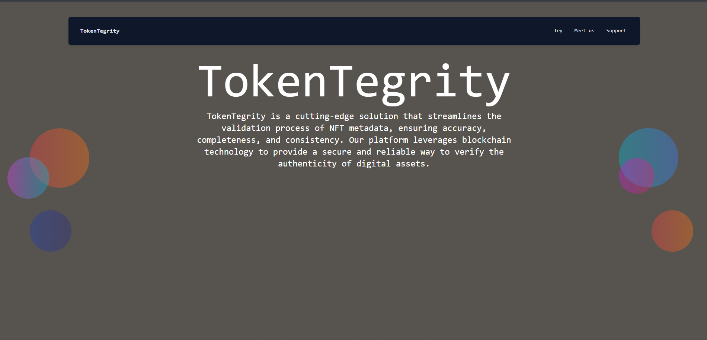
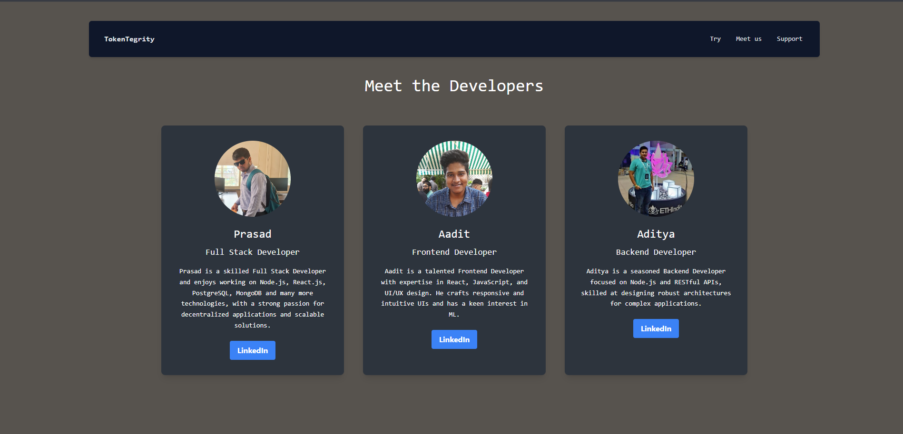

# 🌐 **TokenTegrity** 

### Your Solution for Secure NFT Metadata Validation

---

## 🔍 **What is TokenTegrity?**

**TokenTegrity** is a state-of-the-art platform designed to simplify the validation of NFT metadata, ensuring **accuracy**, **completeness**, and **consistency**. Leveraging **blockchain technology**, TokenTegrity provides a secure and reliable way to verify digital assets' authenticity.

---

## 🌟 **Key Features**

1. **NFT Metadata Validation**  
   - Ensures data integrity for all digital assets.
   - Confirms completeness and accuracy across blockchain.

2. **Seamless Integration with Blockchain**  
   - Verifies the authenticity and ownership of digital assets.
   - Supports leading blockchain networks.

3. **Automated Quality Checks**  
   - Flags inconsistencies in metadata.
   - Provides thorough error reporting for smooth troubleshooting.

---

## 🚀 **How It Works**

1. **Upload Your NFT Metadata**  
   The platform accepts JSON files or API data from your asset's metadata.

2. **Real-Time Validation**  
   TokenTegrity scans the metadata for potential issues and performs quality checks.

3. **Receive Validation Report**  
   Our platform generates an instant report on metadata accuracy, providing transparency and confidence.

4. **Future Prospects**
   We aim to deploy TokenIntegrity as an API which people can incorporate in their code and validate NFT metadata. Example usage is provided below


```javascript
// Example Usage
import TokenTegrityAPI from 'tokentegrity-sdk'

const metadata = { 
    name: "Artwork 1", 
    creator: "John Doe", 
    tokenId: "12345" 
};

TokenTegrityAPI.validate(metadata).then(report => console.log(report));
```
--- 
## images



--- 

## 🔒 Why Choose TokenTegrity?
- Enhanced Security: Built on blockchain for maximum reliability.
- User-Friendly Interface: Intuitive design for both developers and artists.
- Accurate Reports: Instant, comprehensive reports for quick issue resolution.
- Interoperability: Works seamlessly with popular NFT standards and marketplaces.
---

## 📈 Roadmap 
- Phase 1: MVP Launch - Metadata Validation 
- Phase 2: Expand Blockchain Support (Q1 2025)
- Phase 3: deploy as API
---

## 🌍 Get Started
Ready to validate your NFT metadata with TokenTegrity? Sign Up Now to access the future of digital asset validation.

